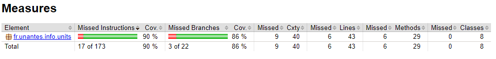
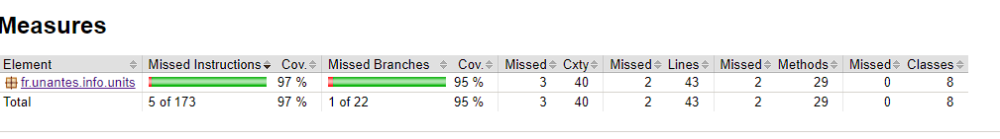
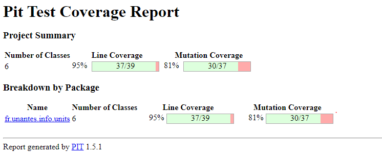

Rapport de travaux pratiques

Rappel des questions :

1)Couverture du code

a)Sans toucher au code du projet testé :

i) Lancez la commande mvn package pour compiler le projet et exécuter la suite de tests.
Est-ce que la suite de tests passe bien ? Au vu des résultats, peut-on être confiant quand à la qualité du code testé ?

ii) Modifiez le pom.xml du projet afin d’ajouter un appel à JaCoCo, puis générez un rapport de couverture de code à l’aide de JaCoCo.

iii) Pensez vous que la couverture du code par la suite de tests est suffisante ?

b)Si la couverture obtenue n’est pas suffisante :

i) Complétez la suite de tests juste assez pour atteindre une bonne couverture.

ii) Si durant cette étape vous découvrez des défauts dans le code testé, notez les et corrigez les !

iii) Effectuez une capture d’écran de votre rapport JaCoCo final.

2)Analyse par mutation

a)Modifiez le pom.xml du projet afin d’ajouter un appel à Pitest (PIT), puis générez un rapport d’analyse de mutation à l’aide de Pitest.

b)Le score de mutation de la suite de tests est-il suffisant ?

c)Si le score de mutation obtenu n’est pas suffisant :

i) Complétez la suite de tests afin d’atteindre un bon score de mutation.

ii) Si durant cette étape vous découvrez des défauts dans le code testé, notez les et corrigez les !

iii) Effectuez une capture d’écran de votre rapport Pitest final.

3)Selon vous, la suite de tests que vous avez obtenue suite à ces deux phases d’améliorations est-elle satisfaisante ? Pourquoi ?

Réponses aux questions :

1) a)

i) Si l'on se réfère à la console tous les tests se sont bien déroulés. Il n'y a eu aucun échec ni erreur.

iii) IL y a une couverture de 90% pour les instructions et de 86%. Ce qui fait 17 sur 173 et 3 sur 22 pour les branches, ce qui est acceptable dans la majorité des cas. Cependant nous ne sommes pas là pour faire un projet ordinaire donc on vise le 100 %.

b)

ii) On peut remarquer que l'implémentation n'est pas cohérente. Lorsque l'on fait les différentes conversions de Inch toInch() on créer un nouveau Inch cependant dans les autres conversions d'unites on utilise juste "this" pour récupérer la valeur.

Dans la classe Gallon.java, la méthode de conversion toGallon() renvoie une valeur "null". C'est une erreur de programmation qui doit être remplacé par "this" pour rester cohérent

Dans la classe Inch.java, la méthode equals renvoie "(o instanceof Length)" alors quelle devrait retourner "(o instanceof Inch)" car sinon le typage ne sera pas le bon et pourra occasionner des erreurs.

iii)
Avant

Après

2)

b)

3)
Après avoir effectué les deux suites de tests, on pourrait ce dire que c'est suffisant cependant d'autres problèmes peuvent survenir.

